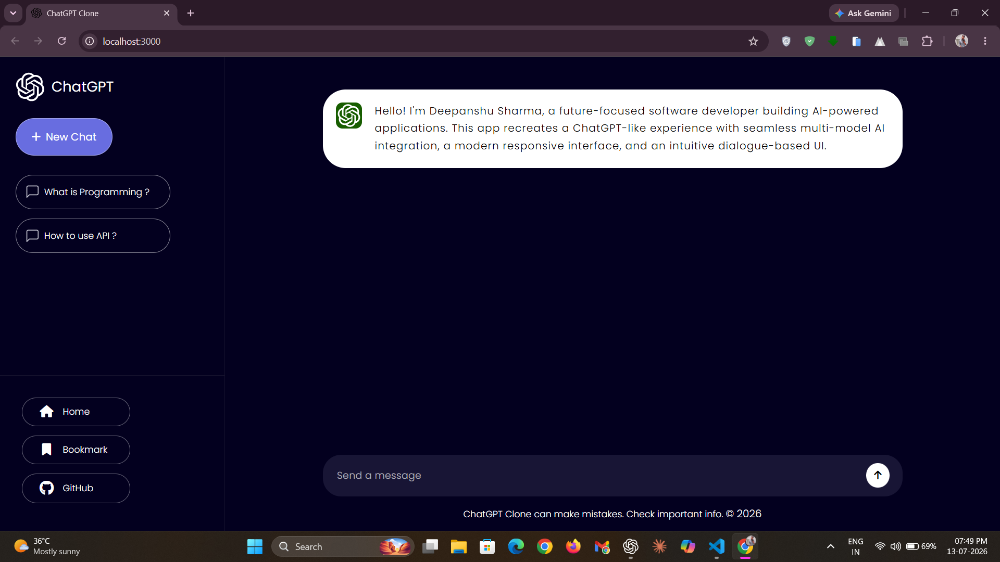
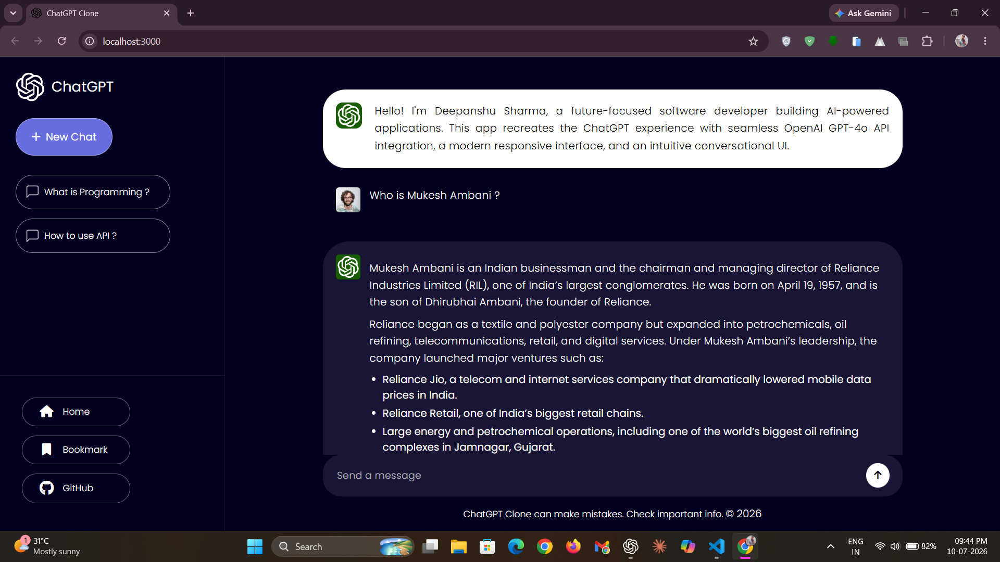
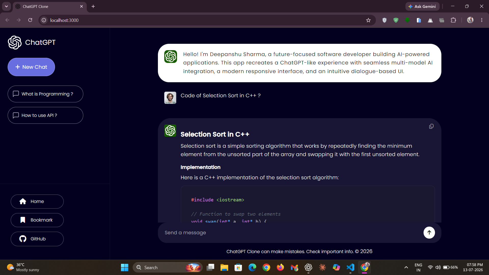
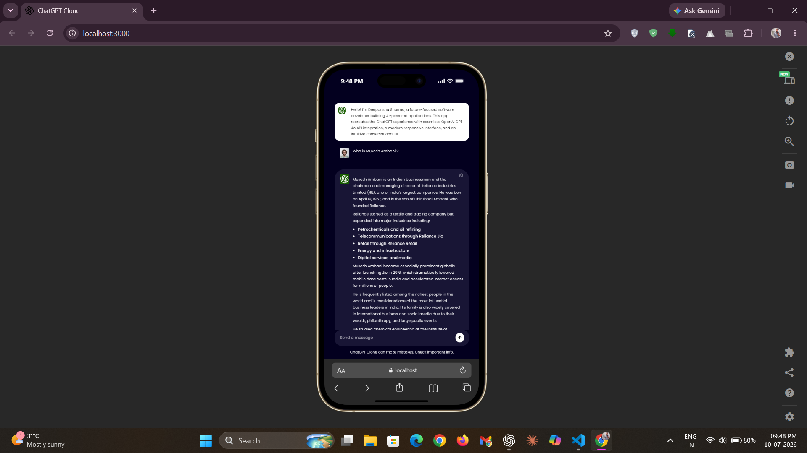

# 💡 ChatGPT Clone

[](https://react.dev/)
[](https://developer.mozilla.org/en-US/docs/Web/JavaScript)
[](https://openai.com/)
[](https://generativeai.net/)
[](https://github.com/remarkjs/react-markdown)
[](https://github.com/remarkjs/remark-gfm)
[](https://developer.mozilla.org/en-US/docs/Web/CSS)
[](https://github.com/react-syntax-highlighter/react-syntax-highlighter)
[](LICENSE)

- A modern generative AI web app serving as a natural LLM interface, recreating a `ChatGPT-like experience` through seamless multi-model integration, rich Markdown rendering, and beautifully formatted code blocks.
- Crafted with a strong focus on usability, responsiveness, and fluid interactions, delivering a polished problem-solving ecosystem optimized for both desktop and mobile devices.

**🌐 Ready to experience conversations inspired by ChatGPT :** [Live Demo](https://chatgptclonee.vercel.app/)

## ✨ Features / Highlights

### 💬 Real-Time Conversational Experience

- Experience natural AI conversations through a responsive platform that instantly connects user prompts with seamless `multi-model integration`, delivering intelligent, real-time responses.
- Every interaction is designed to feel fluid, distraction-free, and closely aligned with the experience of today's leading digital assistants.

### 📝 Rich Markdown Rendering

- AI responses are automatically transformed into beautifully formatted content using `GitHub Flavored Markdown`.
- Supports headings, lists, tables, links, and inline formatting to keep every response structured, readable, and visually consistent.

### 💻 Elegant Code Presentation

- Programming responses are rendered inside elegantly styled, syntax-highlighted code blocks powered by Prism.
- Enhances code readability and makes generated snippets easier to understand, copy, and use in real-world development workflows.

### 🔥 Fast & Responsive User Interface

- Built with React's `component-driven architecture` to deliver smooth rendering, responsive layouts, and a seamless user experience across devices.
- Features automatic scrolling and an adaptive input area that expands naturally as users type longer prompts, ensuring uninterrupted and comfortable interactions.

### 🎯 Productivity-Focused Interactions

- Includes thoughtful productivity features such as `one-click response copying`, predefined prompt shortcuts, and instant conversation reset.
- Supports seamless cancellation of AI response generation without disrupting the overall application experience.

### 🛡️ Reliable Error Management

- Gracefully handles common API and network failures, including authentication issues, rate limits, permission errors, server failures, and network interruptions.
- Provides meaningful feedback while ensuring the interface remains stable and responsive, even when requests are cancelled or unexpected errors occur.

> Intelligent AI Model Reliability:

- Performs an `automatic startup health check` to verify the availability of the preferred AI model before conversations begin.
- Seamlessly falls back to another compatible model whenever the preferred model becomes unavailable, ensuring uninterrupted AI responses throughout the session.

## 📸 Screenshots / Demo

> Take a look at some screenshots showcasing the website.

### 🏠 Home


*The landing interface featuring a clean layout, `quick prompt suggestions`, and an intuitive conversational workspace.*

### 💬 Conversation


*Engage in natural AI conversations with beautifully formatted responses and a distraction-free chat experience.*

### ⚡ Code Generation


*Programming responses are presented with `syntax-highlighted` code blocks for improved readability and effortless copying.*

### 📱 Responsive Design


*A fully responsive interface optimized to deliver a consistent experience across desktop, tablet, and mobile devices.*

## 🛠️ Tech Stack Used

- **⚛️ Frontend:** React v18.2.0
- **🟨 Programming Language:** JavaScript (ES6+)
- **🎨 Styling:** Custom CSS
- **🧠 AI Integration:** OpenAI Node SDK (v5.12.2)
- **🤖 AI Models:** Multiple LLM Support
- **📝 Markdown Rendering:** React Markdown (v10.1.0)
- **📋 GitHub Flavored Markdown:** Remark GFM (v4.0.1)
- **💻 Code Highlighting:** React Syntax Highlighter (v16.1.1)
- **🌙 Syntax Theme:** Prism One Dark
- **🔗 Deployment:** Vercel

## ⚙️ Setup & Installation

> To set up and run the project locally, follow these steps below:

### 1️⃣ Clone the repository

```bash
git clone https://github.com/deepanshu1420/ChatGPTClone.git
```

### 2️⃣ Navigate to the project directory

```bash
cd ChatGPTClone
```

### 3️⃣ Install the required dependencies

```bash
npm install
```

### 4️⃣ Open the `.env.example` file, add your API Key and Base URL, then rename it to `.env`

> Visit `https://api.bluesminds.com/` to generate your API Key and Base URL.

```env
REACT_APP_BLUESMINDS_API_KEY=your_api_key
REACT_APP_BLUESMINDS_BASE_URL=your_base_url
```

### 5️⃣ Start the development server

```bash
npm start
```

✅ **That's it!** The project should now be running locally at:

```text
http://localhost:3000
```

Open the URL in your browser and start experiencing a seamless `ChatGPT-inspired` conversational interface. ☄️